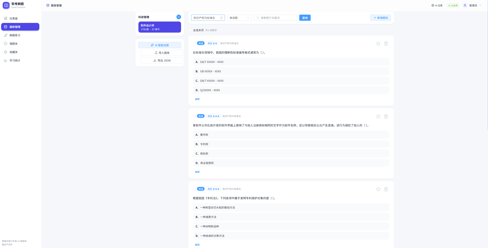

# 软考刷题

前后端分离的软考刷题网页应用：Spring Boot 3 后端 + Vue 3 前端，支持多格式题库导入（Excel / JSON / PDF / Word）、AI 智能出题、四种题型刷题、错题本、收藏夹与学习统计。单用户本地使用，开箱即用。



## 功能一览

| 模块 | 说明 |
| ---- | ---- |
| 题库管理 | 科目/章节两级分类，题目增删改查、关键词/题型筛选、批量勾选删除 |
| 多格式导入 | Excel(.xlsx 按模板)、JSON、PDF、Word(.doc/.docx)；PDF/Word 提取文本后由 AI 分片解析为结构化题目 |
| AI 能力 | DeepSeek/OpenAI 兼容 API：按考点生成题目（预览确认后入库）、解析文档、主观题智能评分；支持本地 Ollama 等无 Key 服务 |
| 刷题练习 | 顺序/随机模式，单选/多选/判断即时判分+解析，问答题支持自评或 AI 评分+评语；支持从题库/错题本/收藏夹取题；答题卡、计时、键盘快捷键 |
| 错题本 | 答错自动收录并累计次数，支持重练、移除、清空 |
| 收藏夹 | 手动收藏重点题目，支持练习收藏 |
| 学习统计 | 累计答题/正确率、近 30 天趋势折线图、科目进度表、答题历史 |

## 题干图片

题库中的题干、选项、解析、问答题参考答案以及 AI 生成预览支持以下图片占位符：

```text
[图:https://example.com/question.png]
```

### 示例

```text
欲开发一个绘图软件……

问题一：下列设计模式中，可以将抽象部分与其实现部分分离，使它们都可以独立变化的是（ ）。

[图:https://example.com/bridge-pattern.png]

A. 观察者模式
B. 桥接模式
C. 单例模式
D. 工厂模式
```

其中图片占位符会被解析为：

```html
<a href="https://example.com/bridge-pattern.png" target="_blank" rel="noopener noreferrer">
  
</a>
```

### 加载时机

1. **导入阶段**：Excel、JSON、PDF、Word 或 AI 生成题目时，后端只保存原始文本，不会下载图片。
2. **页面渲染阶段**：题目组件进入页面 DOM 时，前端将 `[图:url]` 转换成 `` 元素。
3. **图片请求阶段**：浏览器根据图片是否接近当前视口决定是否请求。
   - 当前题目或即将进入视口的图片会尽快加载。
   - 尚未滚动到的题目图片会延后加载。
4. **页面切换阶段**：已加载图片使用浏览器缓存；页面被 `keep-alive` 缓存后返回，不会强制重新下载。

因此，图片不是应用启动时批量下载，也不是导入题库时下载，而是“按需渲染 + 懒加载”。

### 多图片支持

同一段文本中可出现多个图片占位符，每张图片都会独立渲染：

```text
图一：[图:https://example.com/a.png]
图二：[图:https://example.com/b.png]
```

### 显示位置

图片占位符解析能力已覆盖：

- 题库管理列表的题干和选项
- 刷题页题干和选项
- 客观题解析
- 问答题参考答案
- AI 生成题目的预览

### 安全约束

- 只允许 `http://` 和 `https://` 地址。
- 不支持 `javascript:`、`data:`、`file:` 等协议，避免 XSS。
- 普通文本会先进行 HTML 转义，再进行图片占位符替换。
- 图片链接使用 `noopener noreferrer`。
- 图片使用 `referrerpolicy="no-referrer"`，不向图片服务器发送当前页面地址。

## 一键启动脚本

Windows PowerShell 下可在项目根目录执行：

```powershell
.\start.ps1
```

脚本会自动：

1. 查找 JDK 17+，优先使用 `JAVA_HOME` 或 Corretto 21。
2. 在后台启动 Spring Boot 后端。
3. 检查前端依赖并启动 Vite。
4. 等待 `8080` 和 `5173` 端口就绪。
5. 将日志和 PID 写入 `.run/` 目录。

启动成功后访问：

- 前端：http://localhost:5173
- 后端 API：http://localhost:8080/api
- Swagger：http://localhost:8080/swagger-ui.html

日志位置：

```text
.run/backend.log
.run/backend.error.log
.run/frontend.log
.run/frontend.error.log
```

停止脚本启动的服务：

```powershell
.\start.ps1 -Stop
```

如果端口被其他程序占用，脚本会输出占用进程的 PID 并退出，不会强制结束未知进程。

内置 57 道“软件设计师”示例题（覆盖四种题型），首次启动自动加载；检测到旧版内置题缺失时会自动补充，不会覆盖用户自行录入的题目。

## 交互与反馈

- **键盘快捷键**（刷题页）：`A–F` 或 `1–6` 选选项、`1/T` 正确、`2/F` 错误、`Enter` 提交/下一题、`←/→` 翻页、`S` 收藏本题、`Esc` 结束练习。输入框内不拦截，不影响作答输入。
- **答题卡**：侧栏题号网格按「答对/答错/已选未提交/未作答」着色，点击可跳题；来回切题会保留已答内容与判分结果，另有「重做本题」。
- **即时反馈**：答错时同时展示「你的作答」与「正确答案」，并提示已自动收入错题本；问答题按自评或 AI 评分给出「已掌握 / 仍需巩固」结论与复习建议。
- **友好报错**：断网、超时、4xx、5xx 分别给出可执行的中文提示（如“无法连接服务器，请确认后端已启动”），危险操作统一二次确认。
- **批量操作**：题库支持勾选/全选本页并批量删除，同步清理其错题本与收藏记录。
- **空状态引导**：无数据页面不再只显示一行文字，而是给出原因说明与「新增题目 / 导入题库 / AI 出题」等下一步操作。

## 环境要求

- JDK 17+（浏览器方式用于运行后端；桌面客户端运行时同样需要，客户端会自动探测）
- Node.js 18+（前端开发/打包）

## 快速启动

### 1. 启动后端（端口 8080）

```powershell
$env:JAVA_HOME = "C:\Users\15107\.jdks\corretto-21.0.12"
$env:Path = "$env:JAVA_HOME\bin;$env:Path"
.\gradlew.bat bootRun
```

- API 前缀：http://localhost:8080/api
- 接口文档：http://localhost:8080/swagger-ui.html
- 数据库：H2 文件模式，落盘于 ./data/ruankao.mv.db，重启不丢数据

### 2. 启动前端（端口 5173）

```powershell
cd frontend
npm install
npm run dev
```

浏览器访问 http://localhost:5173（开发模式已配置 /api 代理到 8080）。

首次启动会自动创建登录账号：

- 用户名：`admin`
- 密码：`admin123`

登录后可通过右上角用户菜单修改密码。

## 桌面客户端（Electron）

`frontend/` 同时是一个 Electron 应用：打包后自动拉起后端 JAR 与本地静态服务，双击即用，无需手动启动两个服务。

### 开发模式（保留热更新）

```powershell
cd frontend
npm run electron:dev
```

并行启动 Vite（5173）与 Electron，Electron 直接加载 `http://localhost:5173`；后端仍需按「快速启动」单独运行。

### 打包

前置条件：必须先构建后端 JAR，否则打包缺少 `build/libs/RuanKao-1.0.0.jar`。

```powershell
.\gradlew.bat build -x test      # 生成 build/libs/RuanKao-1.0.0.jar
cd frontend
npm install
npm run electron:build:win       # Windows 安装包
```

| 命令 | 说明 | 产物 |
| ---- | ---- | ---- |
| `npm run electron:build` | 当前平台完整安装包 | `frontend/release/` |
| `npm run electron:build:win` | Windows NSIS 安装包 | `frontend/release/软考刷题 Setup 1.0.0.exe` |
| `npm run electron:build:mac` | macOS dmg | `frontend/release/` |
| `npm run electron:build:linux` | Linux AppImage | `frontend/release/` |
| `npx electron-builder --dir --win` | 仅生成免安装目录（调试用，速度快） | `frontend/release/win-unpacked/软考刷题.exe` |

### 部署

1. 拷贝 `软考刷题 Setup 1.0.0.exe` 到目标机器，双击安装（可自选目录）。
2. 目标机器需 **JDK 17+**，客户端按以下顺序自动探测：

   - `%JAVA_HOME%` / `%JDK_HOME%`
   - `%USERPROFILE%\.jdks`、`.gradle\jdks`（IDEA 下载的 JDK）
   - `C:\Program Files\Java`、Amazon Corretto、Eclipse Adoptium、Microsoft、BellSoft、Zulu、GraalVM
   - 注册表 `HKLM\SOFTWARE\JavaSoft` 与 PATH 中的 `java`
   - 探测结果缓存到 `%APPDATA%\ruankao-frontend\.java-path.cache`，下次启动直接使用

3. 首次启动自动建库并导入 57 道示例题；数据与日志都在用户目录，重装/升级不丢失。

| 路径 | 内容 |
| ---- | ---- |
| `%APPDATA%\ruankao-frontend\data` | H2 数据库（`ruankao.mv.db`） |
| `%APPDATA%\ruankao-frontend\app.log` | 客户端 + 后端合并日志 |
| `%APPDATA%\ruankao-frontend\error-page.html` | 启动失败时展示的错误页 |

### 启动失败排查

客户端不会静默退出：后端或本地服务启动失败、后端就绪超时，都会显示内置错误页，列出原因、最近日志与日志路径，并支持「重新尝试启动」原地恢复，无需重装。

| 现象 | 原因 | 处理 |
| ---- | ---- | ---- |
| 错误页「未找到 Java 17+」 | 目标机器无 JDK 17+ | 安装 Amazon Corretto 21 后点「重新尝试启动」 |
| 错误页「后端启动超时」 | 端口 8080 被占用 / Java 版本过低 | 结束占用 8080 的进程后重新尝试 |
| 看不到界面、只有后台进程 | 旧版本启动失败即退出 | 升级到当前版本；升级后仍有异常按上一行排查 |
| 需要完整过程 | — | 打开 `%APPDATA%\ruankao-frontend\app.log` |

## AI 能力配置（可选）

两种方式任选其一：

1. 页面配置（推荐）：点击任意页面顶部的“AI 设置”，或在“题库管理 - AI 智能出题”中进入配置，填写 API 地址、Key、模型后保存，立即生效并持久化到本地 H2。
2. 编辑 src/main/resources/application.yml：

```yaml
ai:
  base-url: https://api.deepseek.com
  api-key: "sk-xxxx"
  model: deepseek-chat
  temperature: 1.0
  timeout-seconds: 180
```

配置后重启即可使用：
- 题库管理 - AI 智能出题：选科目/章节/题型/数量 + 考点，生成后预览确认入库
- 题库管理 - 导入题库：上传 PDF / Word，自动提取文本并由 AI 分片解析为题目
- 刷题练习 - 问答题：AI 已启用时自动评分并返回得分点与复习建议，AI 不可用时自动退回自评

未配置 Key 且不是本地服务时，AI 相关功能会给出明确提示，其余功能不受影响。

## 题库导入格式

### Excel（推荐，模板可从页面下载）

列：科目 | 章节 | 题型 | 题干 | 选项A | 选项B | 选项C | 选项D | 选项E | 答案 | 解析 | 难度 | 来源 | 错题标记

- 题型填：单选 / 多选 / 判断 / 问答（或 SINGLE/MULTIPLE/JUDGE/ESSAY）
- 判断题答案填 对/错（或 TRUE/FALSE）；问答题选项留空，答案为参考答案文本
- 多选答案如 ABD
- 错题标记填 是/TRUE/1 时，导入后自动进入错题本；填 否/FALSE/0 或留空则正常入库

### JSON（导入/导出通用）

```json
[{
  "subject": "软件设计师",
  "chapter": "数据结构与算法",
  "type": "SINGLE",
  "stem": "题干",
  "options": [{ "key": "A", "content": "选项内容" }],
  "answer": "B",
  "analysis": "解析",
  "difficulty": 3,
  "source": "来源",
  "wrong": true
}]
```

## 常用命令

```powershell
.\gradlew.bat bootRun                       # 启动后端
.\gradlew.bat build -x test                 # 构建后端 JAR（桌面端打包前置）
cd frontend; npm run build                  # 前端生产构建（产物在 frontend/dist）
cd frontend; npm run electron:build:win     # 打包 Windows 桌面客户端
cd frontend; npm run electron:dev           # 桌面客户端开发模式（热更新）
```

## 技术栈

- 后端：Java 17 - Spring Boot 3.5 - Spring Data JPA - H2 - Springdoc OpenAPI - Apache POI - PDFBox - Lombok
- 前端：Vue 3 - Vite 5 - Element Plus - Pinia - Vue Router - Axios - ECharts - Tailwind CSS - @lucide/vue
- 桌面端：Electron 44 - electron-builder 26（NSIS / dmg / AppImage）

## 更新特点

### 桌面客户端启动可靠性（当前版本）

- **Java 探测**：探测超时 3s → 10s，`spawnSync` 失败自动回退 `cmd` 执行；新增注册表、`where java`、`Contents/Home/bin`、`jre/bin`、Scoop 等扫描路径；探测失败写 WARN 日志便于定位。
- **不再静默退出**：后端启动失败、本地服务启动失败、后端就绪超时，都会显示内置错误页（原因 + 最近日志 + 日志路径），提供「重新尝试启动 / 打开日志文件 / 退出」，可原地恢复。
- **窗口可见性兜底**：`did-finish-load`、`did-fail-load`、8 秒超时三重触发显示，杜绝「进程在后台但没有界面」。
- **统一异常捕获**：启动流程整体 try/catch，未预期异常也落到可见错误页而非无声退出。
- **错误页支持重试**：修复问题（如刚装好 JDK、释放 8080 端口）后点「重新尝试启动」即可继续。
